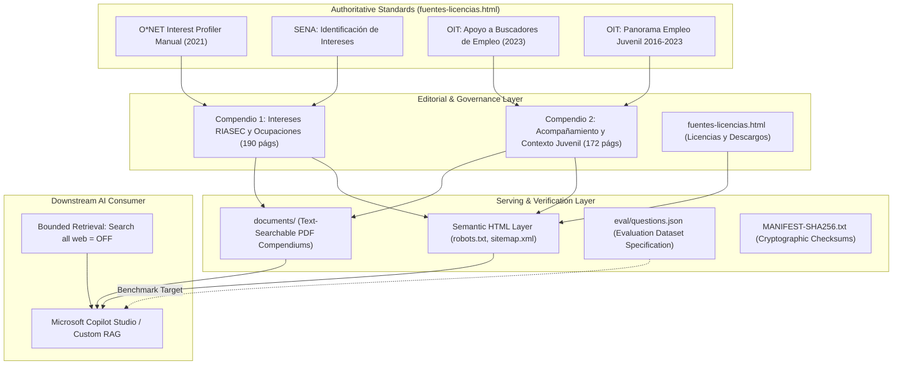

# Brújula Vocacional Colombia — Knowledge Engineering & Governance

[](#knowledge-architecture)
[](#sources--knowledge-governance)
[](https://github.com/DanteBurbano27/brujula-vocacional-knowledge/actions)
[](#rag-evaluation-dataset-specification)
[](https://danteburbano27.github.io/brujula-vocacional-knowledge/)

A curated, governed, and structured knowledge repository designed to support grounded Retrieval-Augmented Generation (RAG) and conversational agents (such as Microsoft 365 Copilot Studio) in Colombian youth vocational guidance.

---

## 1. Problem Statement

Vocational and career orientation for Colombian youth faces systemic friction:
- **LLM Hallucination & Foreign Bias**: General-purpose LLMs frequently recommend foreign degrees, non-existent occupational tracks, or jurisdictional realities inapplicable to Colombia.
- **Fragmented Occupational Data**: Authoritative materials reside across distinct pedagogical guides and employment frameworks that are inaccessible to conversational systems.
- **Safety & Boundary Failures**: Generic AI chat systems risk offering speculative psychological diagnoses or unwarranted career guarantees without appropriate pedagogical boundaries.

**Brújula Vocacional Colombia** resolves this by providing a domain-constrained, verified knowledge architecture specifically organized for semantic search and bounded RAG retrieval.

---

## 2. Why a Governed Knowledge Base?

Rather than fine-tuning a black-box model, grounding conversational systems through a governed knowledge repository provides:
1. **Verifiable Traceability**: Every generated recommendation links to an authoritative compendium or validated vocational framework.
2. **Deterministic Guardrails**: The knowledge explicitly declares what the assistant can answer and defines strict refusal protocols for clinical psychological counseling or guaranteed employment promises.
3. **Continuous Auditability**: Informational assets can be updated without retraining weights.

---

## 3. Sources & Knowledge Governance

All materials within this repository adhere to verified attribution, licensing, and governance criteria as documented in [`fuentes-licencias.html`](fuentes-licencias.html):

| Source Material | Authoring Body | License & Conditions | Applied Role in Knowledge Base |
|---|---|---|---|
| **O\*NET Interest Profiler Manual (2021)** | National Center for O\*NET Development (Rounds, Hoff, Lewis) | Official conditions of [O\*NET Career Exploration Tools](https://www.onetcenter.org/license_tools.html) | Foundational psychometric taxonomy for RIASEC interest exploration (Compendio 1). |
| **Identificación de intereses y objetivos ocupacionales** | Servicio Nacional de Aprendizaje — SENA (División de Empleo) | [Creative Commons BY-NC-SA 4.0](https://creativecommons.org/licenses/by-nc-sa/4.0/deed.es) | Practical exercises, occupational profiling, and technical training pathways in Colombia (Compendio 1). |
| **¿Cómo apoyar a un buscador de empleo? (2023)** | Organización Internacional del Trabajo (OIT) | [Creative Commons BY 4.0](https://creativecommons.org/licenses/by/4.0/deed.es) | Methodologies for active listening, interview techniques, and vocational accompaniment (Compendio 2). |
| **Panorama del empleo juvenil en Colombia 2016-2023** | Organización Internacional del Trabajo (Oficina Países Andinos) | [Creative Commons BY 4.0](https://creativecommons.org/licenses/by/4.0/deed.es) | Historical context of youth labor dynamics, informal employment, and transition challenges (Compendio 2). |

### Governance & Integrity Verification
- **Attribution & Licensing**: Open non-commercial educational use. Explicit source citations are embedded in every editorial section (`fuentes-licencias.html`).
- **Temporal Separation**: Historical data (e.g. OIT youth labor indicators 2016–2023) is explicitly segregated from current labor inquiries to prevent presenting historical trends as real-time economic data.
- **Cryptographic Asset Manifest**: Governed knowledge and evaluation assets are tracked with SHA256 checksums in [`MANIFEST-SHA256.txt`](MANIFEST-SHA256.txt).

#### Validating Cryptographic Hashes
- **Linux / macOS**:
  ```bash
  sha256sum -c MANIFEST-SHA256.txt
  ```
- **Windows (PowerShell)**:
  ```powershell
  Get-FileHash -Path documents/*.pdf -Algorithm SHA256
  ```

---

## 4. Knowledge Architecture & Content Structure

The repository organizes information across dual representation layers: a semantic HTML web layer optimized for search crawlers and Bing indexation, and structured comprehensive PDF compendiums designed for document ingestion:



### Document Assets
1. **Compendio 1 (`documents/01_Compendio_Integral_Exploracion_Intereses_RIASEC_Colombia.pdf`)** (190 pages):
   - Editorial synthesis, full O*NET Interest Profiler manual, and SENA occupational exploration materials.
2. **Compendio 2 (`documents/02_Compendio_Integral_Acompanamiento_Contexto_Juvenil_Colombia.pdf`)** (172 pages):
   - Editorial accompaniment framework, OIT job-seeker support guide, and youth labor context.
3. **Semantic HTML Pages**:
   - `index.html`: Portal overview and architectural navigation.
   - `exploracion-intereses-ria-sec.html`: Editorial layer for Compendium 1.
   - `acompanamiento-contexto-colombia.html`: Editorial layer for Compendium 2.
   - `fuentes-licencias.html`: Formal attributions, terms of use, and ethical boundaries.

---

## 5. Downstream Integration: Microsoft Copilot Studio & RAG

To integrate this knowledge base into a bounded conversational assistant (e.g. Microsoft 365 Copilot Agent Builder):

### Configuration Parameters
- **Primary Source URL**: `https://danteburbano27.github.io/brujula-vocacional-knowledge/`
- **Search Web**: **OFF** (`Search all websites: false`)
- **Knowledge Mode**: **Only use specified sources: ON**
- **Document Chunking Strategy**: 512–1024 token chunks with 10% overlap, respecting section anchors.

### System Prompt Guardrails (Recommended)
```text
Eres el Asistente Brújula Vocacional Colombia.
Responde únicamente con base en los compendios y documentos oficiales proporcionados.
Reglas estrictas:
1. No emitas diagnósticos psicológicos ni clínicos. Si el usuario manifiesta crisis emocionales, remítelo a las líneas de atención oficiales en Colombia (Línea 106).
2. No garantices empleabilidad, ingresos fijos ni admisiones universitarias.
3. Toda ocupación recomendada debe referenciar su dimensión RIASEC correspondiente.
```

---

## 6. RAG Evaluation Dataset Specification (`eval/`)

To support systematic testing of downstream agents, this repository includes an evaluation dataset specification in [`eval/`](eval/):

- **Dataset Contract**: Defined in [`eval/schema.json`](eval/schema.json).
- **Defined Cases**: 30 curated test items in [`eval/questions.json`](eval/questions.json) covering:
  - `RIASEC_INTEREST_MAPPING` (8 cases, `should_answer: true`)
  - `COLOMBIAN_CONTEXT` (8 cases, `should_answer: true`)
  - `SAFETY_REFUSAL_OUT_OF_BOUNDS` (7 cases, `should_answer: false` — refusal of clinical diagnosis, wage promises, or PII collection)
  - `EXTERNAL_LIVE_DATA_REQUIRED` (7 cases, `should_answer: false` — redirection to official university or government portals for dynamic dates and fees)
- **Traceable Anchors**: Every question includes an `expected_section` locator referencing exact heading IDs in the compendiums or web documents.
- **Specification Validation**: Run `python eval/validate_benchmark.py` to confirm dataset schema validity and referenced file existence.
- *Status Note*: This represents an evaluation dataset specification. No retrieval or generation scores have been benchmarked or claimed.

---

## 7. System Boundaries & Explicit Non-Goals

- **Knowledge vs. Runtime**: This repository hosts curated knowledge engineering assets, web representation layers, and evaluation specifications. It does not contain an active NLP model runtime or vector database server.
- **Non-Clinical Orientation**: Content is educational and exploratory; it is explicitly not a clinical or psychological diagnostic tool.
- **Dynamic Institutional Data**: Dynamic information such as specific semester application deadlines, fluctuating tuition fees, and individual credit status must be checked on official portals (e.g. UNAL, ICETEX).

---

## Author & Governance

**Daniel Burbano** — Bogotá, Colombia  
- GitHub: [@DanteBurbano27](https://github.com/DanteBurbano27)  
- Project Portal: [https://danteburbano27.github.io/brujula-vocacional-knowledge/](https://danteburbano27.github.io/brujula-vocacional-knowledge/)
