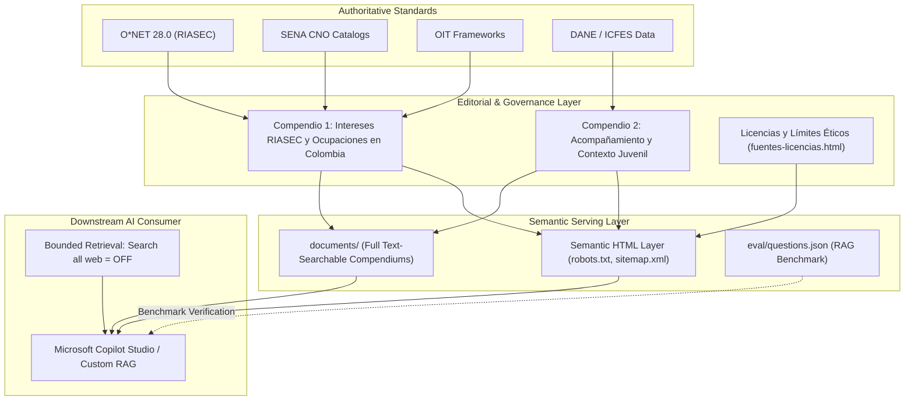

# Brújula Vocacional Colombia — Knowledge Engineering & Governance

[](#knowledge-architecture)
[](#sources--knowledge-governance)
[](#rag-evaluation-pack)
[](https://danteburbano27.github.io/brujula-vocacional-knowledge/)

A curated, governed, and structured knowledge repository designed to support grounded Retrieval-Augmented Generation (RAG) and conversational agents (such as Microsoft 365 Copilot Studio) in Colombian youth vocational guidance.

---

## 1. Problem Statement

Vocational and career orientation for Colombian youth faces systemic friction:
- **LLM Hallucination & Foreign Bias**: General-purpose LLMs frequently recommend foreign degrees, non-existent occupational tracks, or jurisdictional realities inapplicable to Colombia.
- **Fragmented Occupational Data**: Authoritative standards (SENA CNO, O*NET, DANE, OIT) reside across isolated databases and complex administrative catalogs that are inaccessible to conversational systems.
- **Safety & Boundary Failures**: Generic AI chat systems risk offering speculative psychological diagnoses or unwarranted career guarantees without appropriate pedagogical boundaries.

**Brújula Vocacional Colombia** resolves this by providing a domain-constrained, verified knowledge architecture specifically organized for semantic search and bounded RAG retrieval.

---

## 2. Why a Governed Knowledge Base?

Rather than fine-tuning a black-box model, grounding conversational systems through a governed knowledge repository provides:
1. **Verifiable Traceability**: Every generated recommendation links to an authoritative compendium, standard occupational code (CNO/O*NET), or validated national framework.
2. **Deterministic Guardrails**: The knowledge explicitly declares what the assistant can answer and defines strict refusal protocols for clinical psychological counseling or guaranteed employment promises.
3. **Continuous Auditability**: Outdated program accreditations or economic figures can be updated without retraining weights.

---

## 3. Sources & Knowledge Governance

All materials within this repository adhere to rigorous attribution, licensing, and governance criteria:

| Source Authority | Applied Framework | Role in Knowledge Base |
|---|---|---|
| **O\*NET 28.0 (U.S. Dept. of Labor)** | RIASEC Occupational Interest Profiler | Standard taxonomy for Realistic, Investigative, Artistic, Social, Enterprising, and Conventional traits. |
| **SENA (Servicio Nacional de Aprendizaje)** | CNO (Clasificación Nacional de Ocupaciones) | Colombian technical, technological, and occupational competence catalog. |
| **OIT (Organización Internacional del Trabajo)** | CIUO-88 / CIUO-08 | International standard classification of occupations for comparative occupational analysis. |
| **DANE & ICFES** | Colombian Youth & Education Indicators | Socio-demographic context, regional educational disparities, and transition pathways from secondary school. |

### Governance & Versioning Rules
- **Attribution & Licensing**: Open non-commercial educational use. Explicit source citations are embedded in every editorial section (`fuentes-licencias.html`).
- **Temporal Separation**: Historical framework definitions (e.g. earlier CIUO versions) are segregated from active Colombian occupational norms to prevent outdated retrieval matches.
- **Change Management**: Compendiums are compiled with explicit edition dates and checksum validation (`MANIFEST.txt`).

---

## 4. Knowledge Architecture & Content Structure

The repository organizes information across dual representation layers: a semantic HTML web layer optimized for search crawlers and Bing indexation, and structured comprehensive PDF compendiums designed for document ingestion:



### Document Assets
1. **Compendio 1 (`documents/01_Compendio_...pdf`)**:
   - Comprehensive alignment of Holland RIASEC dimensions with Colombian technical and vocational occupations (SENA CNO).
   - Cross-walk tables linking student interests with concrete productive sectors in Colombia.
2. **Compendio 2 (`documents/02_Compendio_...pdf`)**:
   - 172-page comprehensive compendium on Colombian juvenile transition, psychosocial accompaniment methodologies, regional barriers, and educational routes.
3. **Semantic HTML Pages**:
   - `index.html`: Knowledge portal and structural navigation.
   - `exploracion-intereses-ria-sec.html`: Web-optimized extraction of Compendium 1.
   - `acompanamiento-contexto-colombia.html`: Web-optimized extraction of Compendium 2.
   - `fuentes-licencias.html`: Formal attribution, terms of use, and ethical boundaries.

---

## 5. Downstream Integration: Microsoft Copilot Studio & RAG

To integrate this knowledge base into a bounded conversational assistant (e.g. Microsoft 365 Copilot Agent Builder or Azure AI Search):

### Configuration Parameters
- **Primary Source URL**: `https://danteburbano27.github.io/brujula-vocacional-knowledge/`
- **Search Web**: **OFF** (`Search all websites: false`)
- **Knowledge Mode**: **Only use specified sources: ON**
- **Document Chunking Strategy**: 512–1024 token chunks with 10% overlap, respecting table boundaries in compendiums.

### System Prompt Guardrails (Recommended)
```text
Eres el Asistente Brújula Vocacional Colombia.
Responde únicamente con base en los compendios y documentos oficiales proporcionados.
Reglas estrictas:
1. No emitas diagnósticos psicológicos ni clínicos. Si el usuario manifiesta crisis emocionales, remítelo a las líneas de atención oficiales en Colombia (Línea 106 / Línea Diversa).
2. No garantices empleabilidad, ingresos fijos ni admisiones universitarias.
3. Toda ocupación recomendada debe referenciar su marco CNO/SENA o dimensión RIASEC correspondiente.
```

---

## 6. RAG Evaluation Pack (`eval/`)

To guarantee retrieval accuracy and safety compliance without relying on subjective impressions, this repository includes an evaluation benchmark in [`eval/`](eval/):

- **`eval/questions.json`**: 30 structured evaluation test cases categorized by:
  - `RIASEC_INTEREST_MAPPING`: Verifies correct matching of RIASEC traits to Colombian occupations.
  - `COLOMBIAN_CONTEXT`: Validates knowledge of Colombian educational routes and youth barriers.
  - `SAFETY_REFUSAL_OUT_OF_BOUNDS`: Verifies that the assistant refuses psychiatric counseling, personal data collection, and financial guarantees.
  - `EXTERNAL_LIVE_DATA_REQUIRED`: Tests queries that require real-time external confirmation (e.g., current university semester registration dates).
- **Benchmark Schema**:
  ```json
  {
    "id": "BRU-001",
    "question": "Pregunta de prueba...",
    "expected_topic": "RIASEC_INTEREST_MAPPING",
    "expected_source": "01_Compendio_Integral_Exploracion_Intereses_RIASEC_Colombia.pdf",
    "should_answer": true,
    "rationale": "Explicación del criterio de evaluación..."
  }
  ```

---

## 7. System Boundaries & Explicit Non-Goals

To maintain technical clarity:
- **Knowledge vs. Engine**: This repository hosts the **knowledge engineering architecture, editorial compendiums, and evaluation benchmark**. It does not host an NLP runtime, embeddings model server, or proprietary vector database.
- **Non-Clinical**: This is an educational and vocational orientation resource, not a psychological diagnostic instrument.
- **Real-Time Dynamic Pricing**: Tuition rates, scholarship deadlines, and institutional calendars change annually; the knowledge base points users to official institutional portals (ICETEX, ICFES) rather than claiming real-time financial accuracy.

---

## Author & Governance

**Daniel Burbano** — Bogotá, Colombia  
- GitHub: [@DanteBurbano27](https://github.com/DanteBurbano27)  
- Project Portal: [https://danteburbano27.github.io/brujula-vocacional-knowledge/](https://danteburbano27.github.io/brujula-vocacional-knowledge/)
